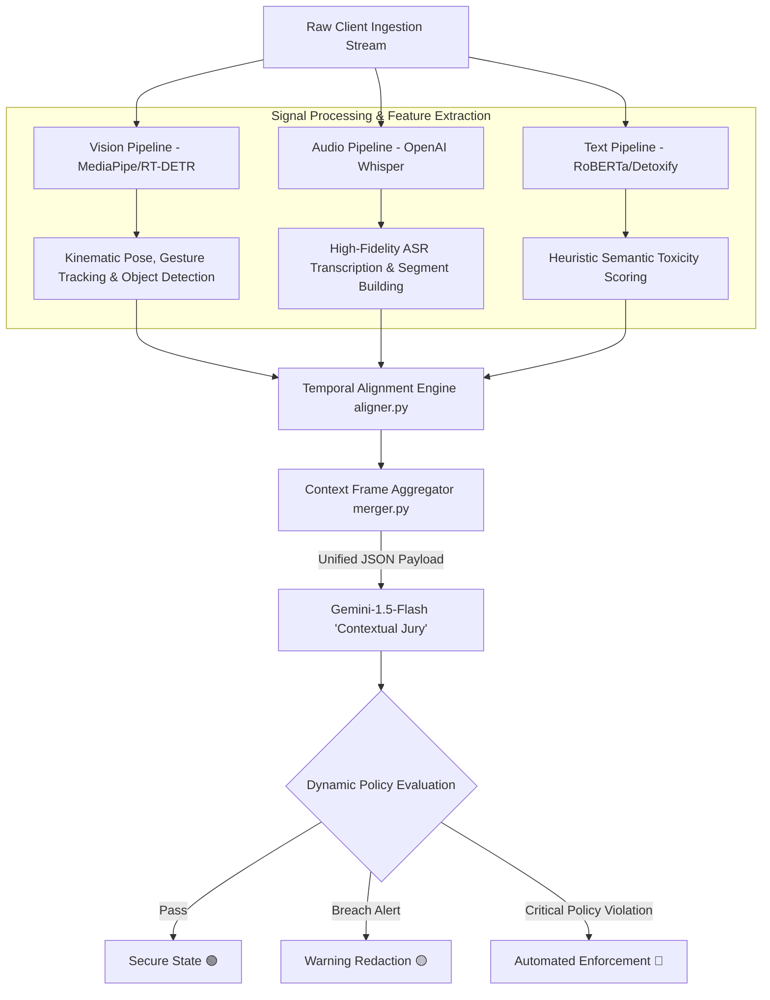
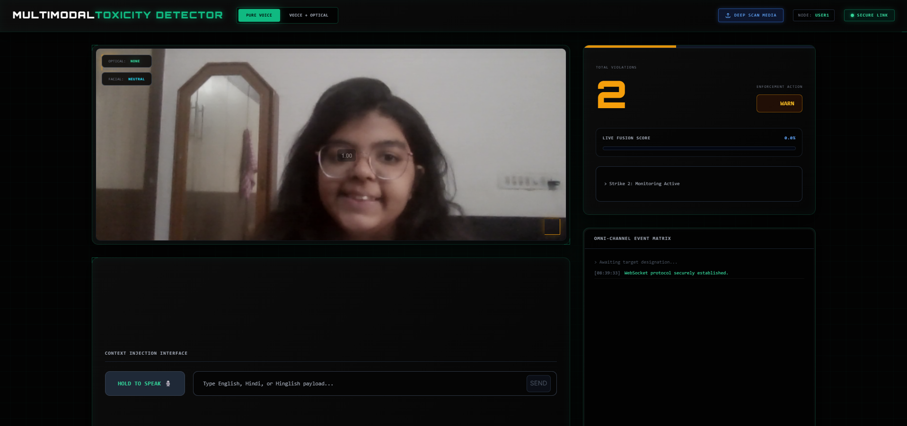
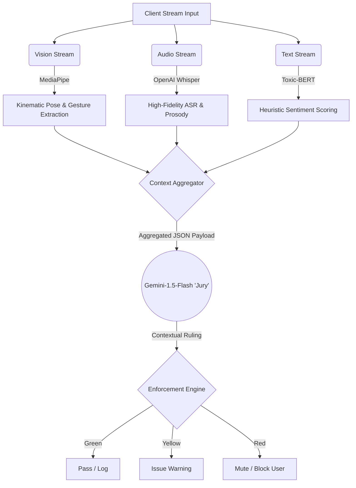

# Multi-Modal Toxicity Detector: AI Moderator 🛡️🤖
📺 **[Watch the full project demo on YouTube](https://youtu.be/ihofGv5SHQE)**

[](https://www.python.org/)
[](https://flask.palletsprojects.com/)
[](https://nodejs.org/)

[](https://developers.google.com/mediapipe)
[](https://github.com/openai/whisper)
[](https://ai.google.dev/)
[](https://huggingface.co/)

[](https://socket.io/)
[](https://streamlit.io/)
[](https://opensource.org/licenses/MIT)

## 📑 Table of Contents
1. [Detailed Project Overview](#-detailed-project-overview)
2. [System Interface & Dashboards](#-system-interface--dashboards)
3. [Core Architecture & Algorithm](#-core-architecture--algorithm)
4. [Key Features & Business Value](#-key-features--business-value)
5. [Technology Stack](#-technology-stack)
6. [Directory Structure](#-directory-structure)
7. [Local Installation](#-local-installation)
8. [API & Data Schemas](#-api--data-schemas)
9. [Future Roadmap](#-future-roadmap)

## 📖 Detailed Project Overview

The **Multimodal Toxicity Detector** is an enterprise-grade security intelligence platform engineered to transcend the limitations of conventional, text-only content moderation. In modern high-throughput digital communication (such as live streaming, multiplayer voice environments, and video conferencing), toxic behavior is rarely unidimensional. It manifests through complex, concurrent signals: aggressive physical postures, high vocal intensity, phonetic evasions, and context-dependent sarcasm that legacy text filters systematically miss.

### 🧠 Deep-Dive Problem Statement

Traditional content moderation architectures operate in absolute isolation, analyzing text strings independently of the behavioral, visual, or acoustic environment in which they occur. This structural disconnect leads to two critical operational vulnerabilities:

1. **Context-Insensitive False Positives**: Static keyword filters and isolated sentiment models cannot differentiate between genuine, malicious harassment and benign, high-affinity cultural slang or high-energy gaming banter. This results in unnecessary user bans, directly damaging user retention and platform vitality.
2. **Adversarial Evasion Techniques**: Malicious actors easily bypass legacy security perimeters by employing lexical substitutions (e.g., leetspeak, intentional typos), non-verbal visual intimidation, or aggressive vocal intonation paired with completely benign vocabulary. 

---

### 💡 The Solution: Triple-Stream Fusion Architecture

To resolve these vulnerabilities, this platform discards isolated classification in favor of a **Triple-Stream Fusion Architecture**. The engine processes parallel real-time telemetry from three decoupled AI pipelines, aligning them into a unified temporal framework before passing the comprehensive context to an LLM-driven orchestration layer.


#### 1. Behavioral Vision Pipeline (`video_pipeline.py`)
* **Core Technology**: Integrated **MediaPipe Tasks** (`face_landmarker`, `hand_landmarker`, `gesture_recognizer`) coupled with an **RT-DETR (Real-Time DEtection TRansformer)** core.
* **Execution**: Tracks micro-expressions, facial topology deltas, and spatial hand configurations concurrently. By calculating frame-to-frame coordinate shifts, the model quantifies kinematic intensity and flags threatening gestures or aggressive spatial boundaries (e.g., physical intimidation markers) in sub-millisecond intervals.

#### 2. Acoustic Intelligence Pipeline (`audio_pipeline.py` & `transcriber.py`)
* **Core Technology**: **OpenAI Whisper** engine optimized for rolling frame inference.
* **Execution**: Captures live audio feeds, converting low-latency audio segments into clean text streams. By leveraging structured temporal tracking via `segment_builder.py`, the pipeline isolates text transcription chunks while mapping vocal presence directly to timestamp intervals, ensuring audio context remains bound to corresponding video frames.

#### 3. Semantic Heuristic Layer (`roberta_detector.py` & `detoxify_detector.py`)
* **Core Technology**: Fine-tuned bidirectional transformer sequence classifiers (**RoBERTa** and **Detoxify**).
* **Execution**: Performs localized sequence classification to evaluate textual baseline risk. By assigning a rapid toxicity index (0.0 to 1.0), this layer detects explicit semantic threats instantly. It serves as a defensive computational gateway: if the text is completely benign and no visual/audio behavioral anomalies are reported, the pipeline completes without routing to heavier models, dramatically cutting API overhead.

#### 4. The LLM 'Contextual Jury' Fusion (`merger.py` & `jury_logic.py`)
* **Core Technology**: **Gemini-1.5-Flash** serving as a zero-shot multi-layered reasoning engine.
* **Execution**: The architectural climax. When the primary heuristic thresholds are breached, the `merger.py` agent aggregates visual anomaly flags, audio transcriptions, and raw NLP scores into a single structured payload. The Gemini engine processes this comprehensive metadata block, applying deep context analysis to differentiate between harmful intent and harmless sarcasm.

### ⚙️ System Engineering & Performance Philosophy

The underlying codebase is engineered explicitly for **High-Concurrency, Low-Latency (HCLL)** execution profiles:

* **Temporal Alignment & Synchronization (`aligner.py`)**: Resolves the classic multimodal lag problem. Because audio transcriptions, transformer text evaluations, and visual frame renderings process at varying speeds, the alignment engine uses a rolling time-window matrix to stitch concurrent data arrays together accurately before judging user behavior.
* **Dynamic Content Redaction (`censor.py` & `blur.py`)**: Enables automated, real-time remediation. Depending on the jury's verdict, the backend can dynamically blur toxic video regions or redact specific audio segments over the live streaming wire via full-duplex WebSockets without terminating the connection.
* **Modular Policy Injection via RAG (`rag_engine.py`)**: Eliminates the need for model fine-tuning. System trust and safety parameters can be rewritten via JSON configurations or dynamically queried from an internal policy vector store. This allows platforms to modify enforcement strictness (e.g., matching a high-intensity esports tournament vs. an online classroom) instantly.

---
## 🖥 System Interface & Dashboards

The system features a **Unified Observability Dashboard** engineered for real-time decision-making and post-incident auditing. This interface acts as the central command center for the entire multimodal pipeline, bridging the gap between raw data inference and actionable moderation.

<p align="center">
  
</p>

### 📊 Core Dashboard Modules
* **Multimodal Stream Aggregator**: A side-by-side visualization feed rendering the active video stream (MediaPipe overlay), live audio waveforms, and a scrolling transcript. This enables operators to correlate visual posture with verbal content in real-time.
* **Intervention Status Engine**: An automated state-machine UI that updates enforcement status based on the "Jury" feedback loop:
    * 🟢 **Status: Secure** — Metrics within normal behavioral parameters.
    * 🟡 **Status: Warning** — Triggered by mild non-compliance; displays specific policy triggers.
    * 🔴 **Status: Enforced** — Active block/mute action with timestamp and violation details.
* **Explainability Panel (LLM-Logic)**: A specialized panel that renders the "Jury's Decision" from **Gemini-1.5-flash**. This provides a plain-text rationale for every flag, demystifying the AI decision-making process for platform moderators.

### ⚙️ Control & Configuration
* **Policy Threshold Overrides**: Allows administrators to dynamically toggle sensitivity levels for specific streams (e.g., adjusting thresholds for audio aggression vs. visual gestures).
* **Audit & Export Utility**: A built-in feature for incident logging. It generates structured summaries of flagged events—capturing visual frame contexts, audio transcripts, and the Jury’s explanation—formatted for regulatory compliance review.
* **System Health Telemetry**: Real-time monitoring of inference pipeline latency (ms) across Vision, Audio, and NLP streams to ensure performance remains within sub-100ms thresholds.
## 🧠 Core Architecture & Algorithm

The system operates on a **Triple-Stream Fusion Architecture**. Rather than relying on independent, isolated models, the architecture ingests parallel data streams, aligns them temporally, and passes a unified "Context Frame" to an LLM-based reasoning engine.

### 🌊 Data Pipeline & Flow Diagram


## 💎 Key Features & Business Value

While traditional moderation tools focus purely on keyword matching, the **Multimodal Toxicity Detector** is designed as an enterprise-grade security solution. It reduces moderation overhead, improves user retention, and provides highly auditable safety metrics.

### ✨ Core Features
* **Zero-Day Toxicity Detection**: By analyzing intent and behavioral cues (vocal tone, physical gestures) rather than static dictionaries, the system catches novel harassment tactics and adversarial slang evasions instantly.
* **Explainable AI (XAI) Logging**: Every enforcement action (Warn/Mute/Block) is accompanied by a plain-text rationale generated by the LLM Jury. This eliminates the "black box" problem of traditional AI moderation.
* **Dynamic Policy Injection**: System administrators can update moderation thresholds dynamically via JSON configurations without needing to retrain underlying machine learning models or redeploy the application.
* **Cost-Optimized Inference Pipeline**: To minimize LLM API costs, the system uses **Toxic-BERT** as a lightweight, high-speed gatekeeper. The heavier **Gemini-1.5-flash** model is only triggered when the baseline toxicity threshold is breached, ensuring high scalability.

### 📈 Business Impact
* **Drastic Reduction in False Positives**: By understanding context, the system prevents the accidental banning of users engaged in benign cultural slang or gaming banter, directly protecting user retention and platform engagement.
* **Automated Compliance & Auditing**: The structured audit logs (capturing text, visual frame metadata, and AI rationale) provide clear paper trails for trust & safety teams, streamlining regulatory compliance and user-appeal reviews.
* **Proactive Risk Mitigation**: By detecting physical and vocal escalations *before* explicit text is typed, platforms can intervene in real-time, preventing toxic incidents from escalating into PR crises or legal liabilities.
  ## 💻 Technology Stack

The system is built on a modular, microservices-inspired architecture, utilizing a blend of high-speed streaming protocols and state-of-the-art multimodal AI models.

### 🧠 AI & Machine Learning Pipeline
* **Gemini API (1.5-Flash)**: The core LLM utilized for the "Contextual Jury" layer, providing high-speed, zero-shot reasoning and explainable enforcement decisions.
* **OpenAI Whisper**: Transformer-based Automatic Speech Recognition (ASR) for real-time, highly accurate audio transcription.
* **MediaPipe**: Google's open-source framework used for low-latency facial landmark tracking and hand gesture recognition (Vision Pipeline).
* **Hugging Face Transformers (Toxic-BERT)**: Fine-tuned NLP model used as the primary heuristic gatekeeper for high-speed sentiment and toxicity scoring.

### ⚙️ Backend & Infrastructure
* **Python (3.10+)**: The primary language for core AI inference, data aggregation, and backend logic.
* **Flask**: Lightweight WSGI web application framework used to serve the API endpoints and manage application state.
* **Node.js**: Utilized for handling asynchronous microservices and routing auxiliary data payloads outside the main Python inference loop.

### ⚡ Real-Time Data Flow
* **WebSockets (Flask-SocketIO)**: Provides the full-duplex, bi-directional communication channels required for sub-100ms streaming of video, audio, and text to the dashboard.

### 🖥 Frontend Observability
* **HTML5 / CSS3 / Vanilla JavaScript**: Drives the Unified Observability Dashboard.
* **Chart.js / Custom UI Components**: Renders the live system telemetry, confidence scores, and intervention status alerts.
  ## 📂 Directory Structure

The repository is organized to enforce a strict separation of concerns, isolating the machine learning inference pipelines from the web application logic and routing.

## 📂 Directory Structure

```text
Multimodal-toxicity-detector/
├── ai_src/                     # Core Machine Learning & Inference Pipelines
│   ├── __pycache__/
│   ├── aligner.py
│   ├── app.py                  # AI Microservice / API entry point
│   ├── audio_pipeline.py       # Audio stream handling
│   ├── blur.py
│   ├── censor.py               # Enforcement & redaction logic
│   ├── clip_filter.py
│   ├── config.py               # Pipeline configuration
│   ├── detoxify_detector.py    # Text toxicity analysis
│   ├── extractor.py
│   ├── face_landmarker.task    # MediaPipe weights
│   ├── format_converter.py
│   ├── gesture_recognizer.task # MediaPipe weights
│   ├── hand_landmarker.task    # MediaPipe weights
│   ├── index.html              # Interface view
│   ├── merger.py               # Context frame aggregator
│   ├── pipeline.py             # Main orchestration logic
│   ├── rag_engine.py           # Retrieval-Augmented Generation for policy
│   ├── roberta_detector.py     # NLP/Semantic reasoning
│   ├── rtdetr_detector.py      # Real-Time DEtection TRansformer logic
│   ├── rtdetr-l.pt             # RT-DETR model weights
│   ├── segment_builder.py
│   ├── temporal_filter.py
│   ├── transcriber.py          # Whisper speech-to-text integration
│   └── video_pipeline.py       # Vision stream handling
├── controllers/                # Application logic & routing
├── docs/                       # Project documentation
├── models/                     # Additional pre-trained weights
├── policies/                   # Moderation rules & thresholds
├── routes/                     # API Endpoint definitions
├── uploads/                    # Temporary storage for processing
├── .gitignore                  
├── dashboard.png               # Interface preview image
├── eslint.config.js            # Linter configuration
├── face_landmarker.task        
├── fist.xml                    # Haar cascade / feature tracking
├── gesture_recognizer.task     
├── haarcascade_eye.xml         # Vision feature tracking
├── hand_landmarker.task        
├── hand.xml                    # Vision feature tracking
├── index.js                    # Node.js backend entry
├── package-lock.json           
├── package.json                # Node.js dependencies
├── palm.xml                    # Vision feature tracking
├── README.md                   # Project documentation
├── requirements.txt            # Python dependencies
├── test_video.mp4              # Sample input for system testing
└── vite.config.js              # Frontend build configuration
```
## 🚀 Local Installation

Because this architecture utilizes a decoupled backend (Python) and frontend/microservice layer (Node.js/Vite), you will need to set up both environments to run the system locally.

### Prerequisites
* **Python 3.10+**
* **Node.js (v18+) & npm**
* Valid **Gemini API Key**

### Step 1: Clone the Repository
```bash
git clone [https://github.com/MOLI28/Multimodal-toxicity-detector.git](https://github.com/MOLI28/Multimodal-toxicity-detector.git)
cd Multimodal-toxicity-detector
```
###Step 2: Python Environment Setup (AI Backend)
We highly recommend using a virtual environment to isolate the heavy ML dependencies (MediaPipe, Whisper, Transformers).
```bash
# Create and activate virtual environment
python -m venv venv
source venv/bin/activate  # On Windows use: venv\Scripts\activate

# Install AI dependencies
pip install -r requirements.txt
```
###Step 3: Node.js & Vite Setup (Frontend/Microservices)
Install the required packages for the real-time observability dashboard and Node backend.
```bash
# Install NPM dependencies
npm install
```
###Step 4: Environment Configuration
Create a .env file in the root directory. This prevents your private API keys from being exposed.

```bash
GEMINI_API_KEY=your_actual_api_key_here
```

###Step 5: System Execution
To run the full multimodal pipeline, you will need to start both the Python inference server and the Node/Vite interface. Open two separate terminal windows:

Terminal 1 (Backend - Python Inference):

```bash
source venv/bin/activate  # Windows: venv\Scripts\activate
python ai_src/app.py
```
Terminal 2 (Frontend - Vite Dashboard):

```bash
npm run dev
# OR if using a custom Node start script:
node index.js
```
Once both servers are running, the application will provide a localhost port (typically http://localhost:5173 for Vite) where you can access the Unified Observability Dashboard.
## 📡 API & Data Schemas

The system utilizes a dual-protocol communication layer: REST for dashboard querying and state management, and WebSockets for low-latency, real-time multimodal streaming.

### 🔌 WebSocket Events (Real-Time Streaming)
* **`connect_stream`**: Initializes the full-duplex connection between the client UI and the Python inference engine.
* **`ingest_frame`**: Client emits base64 encoded video frames and audio chunks.
* **`alert_broadcast`**: Server emits real-time moderation state changes back to the client UI.

### 🌐 REST API Endpoints
* **`GET /api/v1/health`**: Returns system telemetry and model inference latency.
* **`GET /api/v1/audit/logs`**: Retrieves historical enforcement logs for compliance review.
* **`POST /api/v1/analyze/batch`**: Allows for batch processing of recorded video/audio files outside of the live streaming context.

### 🧩 The "Context Frame" Data Schema
The core of the architecture relies on aggregating the three AI pipelines into a single JSON payload before sending it to the Gemini "Jury." Here is the standard schema generated by the `merger.py` service:

```json
{
  "event_id": "evt_987654321",
  "timestamp": "2026-06-14T08:59:47Z",
  "stream_source": "user_cam_01",
  "inference_metrics": {
    "vision_latency_ms": 42,
    "audio_latency_ms": 65,
    "nlp_latency_ms": 12
  },
  "aggregated_context": {
    "vision_flags": ["rapid_proximity_change", "clenched_fist"],
    "audio_transcript": "If you don't back down right now I swear...",
    "bert_base_toxicity_score": 0.88
  },
  "jury_decision": {
    "enforcement_action": "MUTE",
    "rationale": "While the vocabulary used is not explicitly profane, the combination of aggressive physical posturing (clenched fist, rapid movement) coupled with a threatening verbal cadence indicates a high probability of physical or emotional escalation.",
    "confidence": 0.94
  }
}
```
## 🔮 Future Roadmap

The current architecture establishes a robust foundation for broader digital safety applications. The immediate development pipeline includes:

* **Initiative: ScamGuard:** Evolving the multimodal pipeline beyond toxicity to detect real-time behavioral fraud and social engineering tactics. This upcoming phase will integrate deepfake audio/video defense mechanisms alongside the existing sentiment architecture.
* **Cloud-Native Orchestration:** Transitioning the application from local execution to a containerized microservices architecture using Docker and Kubernetes. This will allow the Vision, Audio, and NLP nodes to scale horizontally independent of one another during high-traffic spikes.
* **Edge-Optimized Privacy:** Researching the migration of the initial MediaPipe and Whisper inferencing to client-side Edge AI (via WebAssembly). Processing biometric data directly on the user's device before sending the "Context Frame" to the server will drastically reduce latency and ensure strict data privacy compliance.

---
*Architected and Developed by Moli Maheshwari | B.Tech Computer Science Candidate (2028)*
